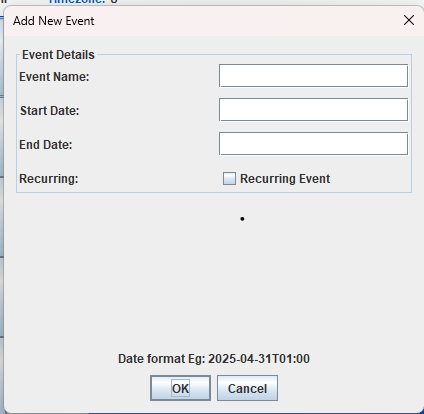

## 1. Launching the Application

- Open the `CalendarApp.java` file, which is the main entry point of the application.
- Click the **Run** button in the top right corner (typically green in color).
- An interactive GUI window will appear on your screen.

---

## 2. Main GUI Interface

Upon launching the application, the screen above will appear — this is the **main interface** of the Calendar App. The layout is organized into three main sections: the **Top Navigation Bar**, the **Calendar View**, and the **Bottom Panel**.

---

### Top Navigation Bar

This section provides access to essential features:

- **Month and Year Selector**  
  Displays the current month and year (e.g., **June 2025**).  
  Use the **`<`** and **`>`** arrows to navigate between months.

- **Calendar Dropdown**  
  Lets you choose from existing calendars.  
  A **`+`** icon is also available in the dropdown to create a new calendar.

- **Edit Events Across Calendar**  
  Opens a tool to search and modify multiple events sharing the same name or properties.

---

### Calendar View

The central portion of the interface displays a **monthly grid layout**:

- Each **cell** represents a day in the current month.
- Clicking on a cell allows you to view events scheduled for that day.
- If no events exist, a message saying **"No Matching Events"** will appear.
- You’ll also have the option to **add a new event** for the selected day.
- Above the calendar grid, the **Calendar Name** and **Timezone** (e.g., `America/New_York`) are clearly displayed.

---

### Bottom Panel

This section includes tools for importing and exporting calendar data:

- **Import into Current Calendar with CSV**  
  Upload a `.csv` file to add events to the current calendar.

- **Export Current Cal CSV**  
  Save all events in the current calendar as a `.csv` file for backup or sharing.

---

## 3. Creating a Calendar

To create a new calendar:

1. **Open the Calendar Dropdown**  
   Click the calendar name dropdown in the top navigation bar.

2. **Click the '+' Icon**  
   Select the **`+`** icon to initiate the creation process.

3. **Enter Calendar Details**  
   In the popup:
   - Provide a unique calendar name.
   - Enter a valid timezone (e.g., `America/New_York`).

4. **Confirm Creation**  
   Click **OK** to create the calendar. It will become the active calendar.

5. **Error Handling**  
   If the calendar name already exists or the timezone is invalid, an error message will be shown:  
   **"Error in creating calendar. Check if calendar name already exists or check timezone."**

---

## 4. Switching Between Calendars

To switch to another calendar:

1. **Open the Calendar Dropdown**  
   Click the dropdown next to the **`>`** month navigation arrow.

2. **Select a Calendar**  
   Choose from the list of available calendars.

3. **Feedback on Selection**  
   - The **bottom panel color** may change to reflect the selected calendar.
   - The **calendar name and timezone** will update accordingly.

---

## 5. Creating an Event

To add a new event:

1. **Click a Day Cell**  
   Navigate to the desired month and click on the cell representing the target date.  
   _Example: April 1st, 2025 → click "1" in April 2025._

2. **View Existing Events**  
   A popup appears displaying any existing events. If none exist, it shows **"No Matching Events"**.

3. **Add New Event**  
   Click **"Add New Event"** in the popup. A form will open as shown below:

    

4. **Fill in Details**
   - **Event Name**
   - **Start and End Date** (format: `yyyy-MM-ddTHH:mm`, e.g., `2025-04-01T10:00`)
   - **Recurring** checkbox if the event should repeat

5. **Recurring Options** (visible if selected):
   - **Until Date**: Date the event stops recurring
   - **Repeats**: Days of the week (`M`, `T`, `W`, etc.)
   - **Number of Occurrences**: How many times to repeat

6. **Submit**
   - Click **OK** to save, or **Cancel** to discard the event.

---

## 6. Editing Events Across Calendars

To bulk-edit events:

1. **Click "Edit Events Across Calendar"**  
   Found in the top panel of the main screen.

2. **Search for Events**  
   A window opens where you can search for events using a combination of the following filters:

   - **Event Name**
   - **Start Date**
   - **End Date**  
   > Format: `yyyy-MM-ddTHH:mm` (e.g., `2025-04-31T01:00`)

   To edit the events you can search by:
   - Only providing the **Event Name** to see all events matching that name across calendars.
   - Providing both **Event Name** and **Start Date** to narrow down the results further. If you search using event name and start date, all future events having that name will be edited too.
   - Providing all three — **Name**, **Start Date**, and **End Date** — to search for events that match all criteria.

   Click **Search** to display the matching results.

   

3. **View Results**  
   Matches appear in the textbox below the search button.

4. **Edit Properties**  
   - **Property Name**: What to change (e.g., `name`, `location`)
   - **New Value**: The updated value

5. **Apply Changes**  
   Click **Update All Matches** to apply updates to all listed events.

---

## 7. Exporting the Calendar

- Click **"Export Current Cal CSV"** in the bottom panel of the main interface.
- After export, the path to the generated file will appear in red above the import/export buttons.

---

## 8. Importing a Calendar

- Click **"Import into Current Calendar with CSV"** (bottom panel).
- A file selection dialog will appear. Choose a valid `.csv` file.
- Click **Open** to import the data into your calendar.
- If the file path is invalid, an error message will appear: **"Error importing calendar."**
